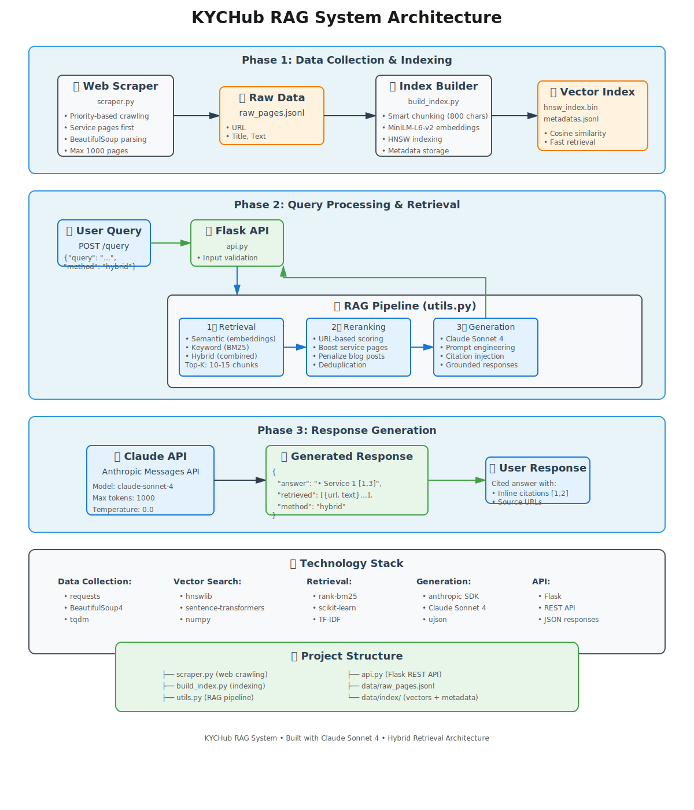

# RAG system for KYCHub

This repository implements a Retrieval-Augmented Generation (RAG) pipeline over content scraped from **kychub.com**.
It includes a deterministic scraper, sentence-aware chunking + indexing, semantic & keyword retrieval, and a Claude-backed generator that returns grounded answers.

---

## Quick summary (one-liner)

1. Scrape → `data/raw_pages.jsonl`
2. Build index → `data/index/*` (HNSW + metadata)
3. Run API → POST `/query` to get grounded answers

---

## Prerequisites

1. Python 3.10+ (tested on 3.10)
2. `venv` for isolated env
3. Internet access (for scraping and calling Anthropic/Claude)

Install:

```bash
python3 -m venv venv
source venv/bin/activate
pip install --upgrade pip 
pip install -r requirements.txt
```

---

## .env — example and how to load it

Create a `.env` in project root with the following *example* content (do **not** commit secrets):

```
# .env (example)
ANTHROPIC_API_KEY=
CLAUDE_MODEL=claude-sonnet-4-20250514
CLAUDE_MAX_TOKENS=400
MAX_TOP_K=100
```

Two safe ways to export `.env` variables into your shell:

**(A) Portable, recommended for bash/zsh**

```bash
# exports variables from .env for the current shell session
set -o allexport
source .env
set +o allexport
```

**(B) grep-based (works often but can fail with spaces):**

```bash
export $(grep -v '^#' .env | xargs)
```

---

## Commands (full pipeline)

### 1) Scrape site (deterministic)

```bash
source venv/bin/activate
python src/scraper.py
# -> creates data/raw_pages.jsonl
```

### 2) Build index (chunking + embeddings + HNSW + BM25)

```bash
python src/build_index.py
# -> creates data/index/hnsw_index.bin and data/index/metadatas.jsonl (and sample_chunks.txt)
```

### 3) Run API server

```bash
# ensure .env variables are exported (see above)
python src/api.py
# server binds to 0.0.0.0:5000
```

---

## API (for grader/evaluator)

### POST `/query`

**Request JSON**

```json
{
  "query": "What services does KYC Hub provide?",
  "top_k": 5,
  "method": "semantic"   // one of: semantic | keyword | bm25 | tfidf | hybrid
}
```

**Response**

```json
{
  "query": "...",
  "method": "...",
  "top_k": 5,
  "answer": "...",       // Claude-generated, grounded in retrieved passages
  "retrieved": [ ... ],  // list of passages (text, source/url, score, title)
  "paraphrase_used": true
}
```

### Health check

```
GET /health
-> {"status":"ok"}
```

---

## Example test curl commands

**Semantic query**

```bash
curl -s -X POST http://127.0.0.1:5000/query \
 -H "Content-Type: application/json" \
 -d '{"query":"What services does KYC Hub provide?","top_k":5,"method":"semantic"}' | jq
```

**Keyword search (exact-term)**

```bash
curl -s -X POST http://127.0.0.1:5000/query \
 -H "Content-Type: application/json" \
 -d '{"query":"cancellation refund policy","top_k":10,"method":"keyword"}' | jq
```

**BM25 (term-frequency)**

```bash
curl -s -X POST http://127.0.0.1:5000/query \
 -H "Content-Type: application/json" \
 -d '{"query":"refund policy cancellation","top_k":10,"method":"bm25"}' | jq
```

---

## Files & purpose (short)

* `src/scraper.py` — deterministic cleanup scraper (produces raw JSONL)
* `src/build_index.py` — chunker + embed + HNSW + save metadata
* `src/utils.py` — retrieval functions (semantic, bm25, tfidf, keyword) and prompt builder
* `src/api.py` — Flask endpoints
* `requirements.txt` — dependencies
* `data/` — raw_pages.jsonl and generated index files (not committed if large)

---

## Architecture Diagram



---
